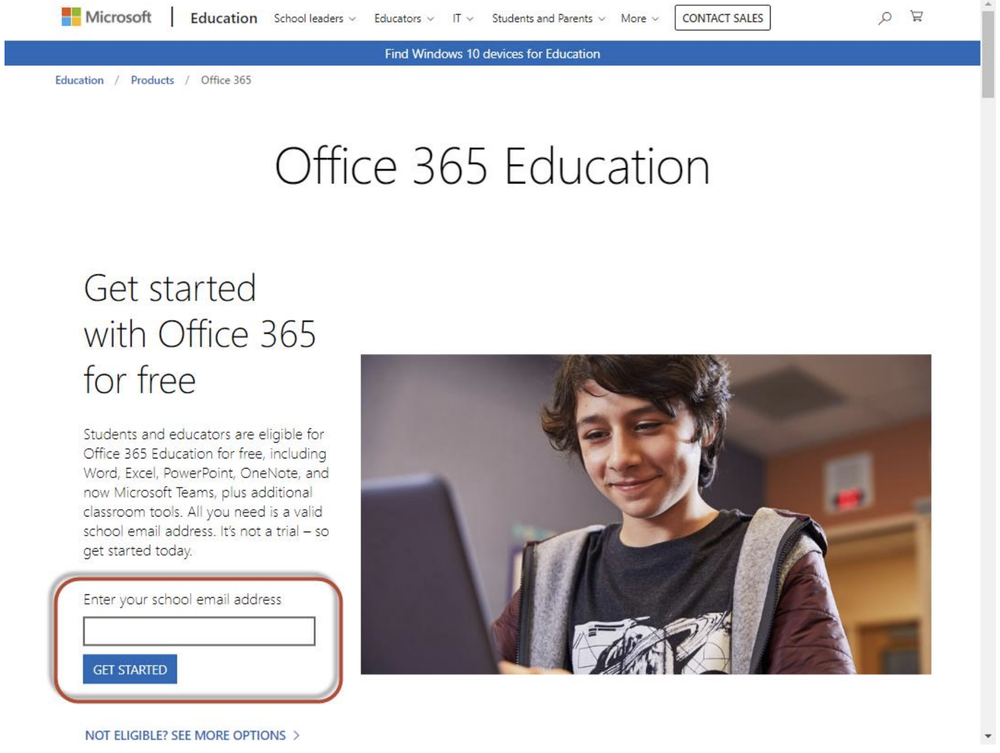
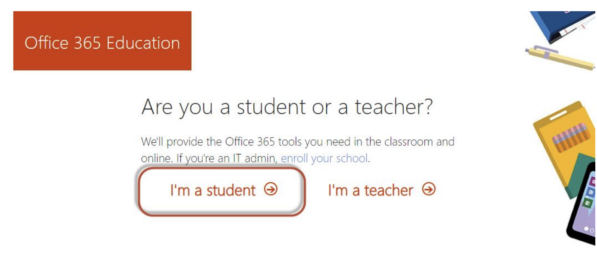
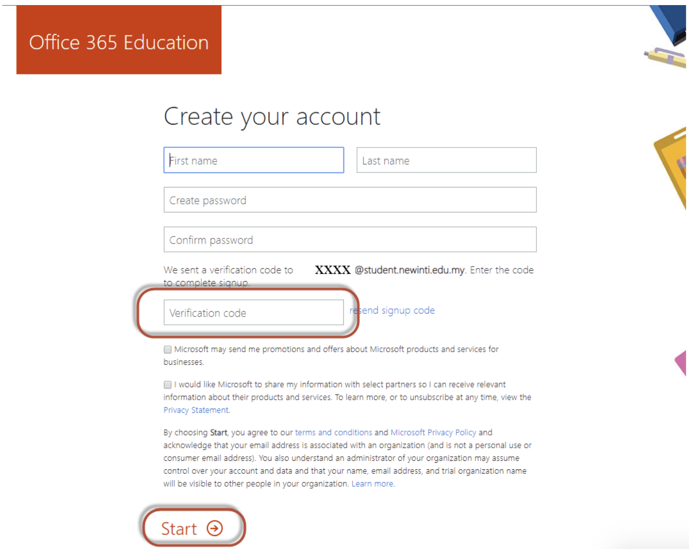
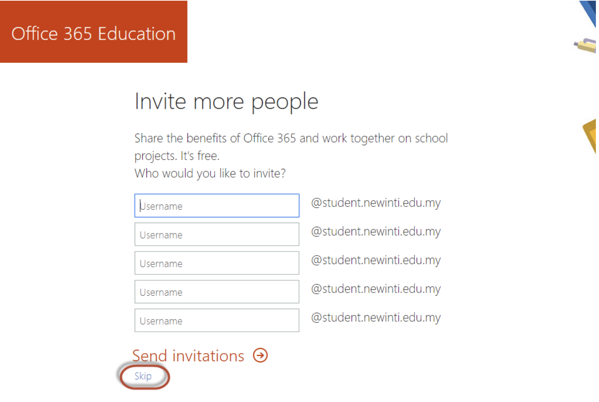
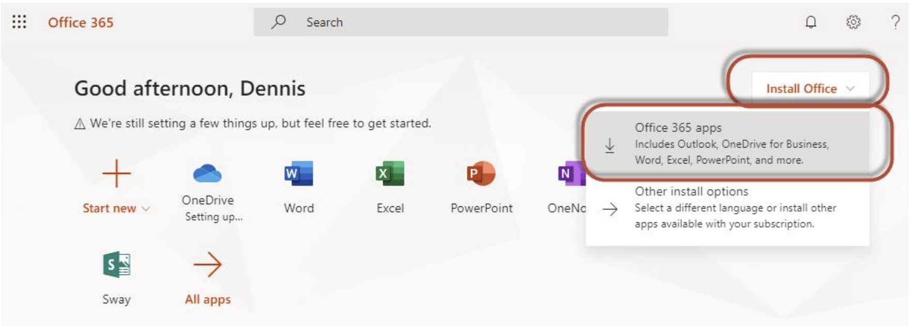
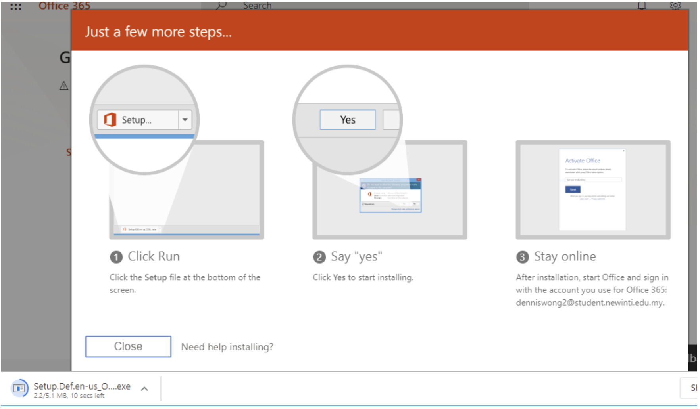
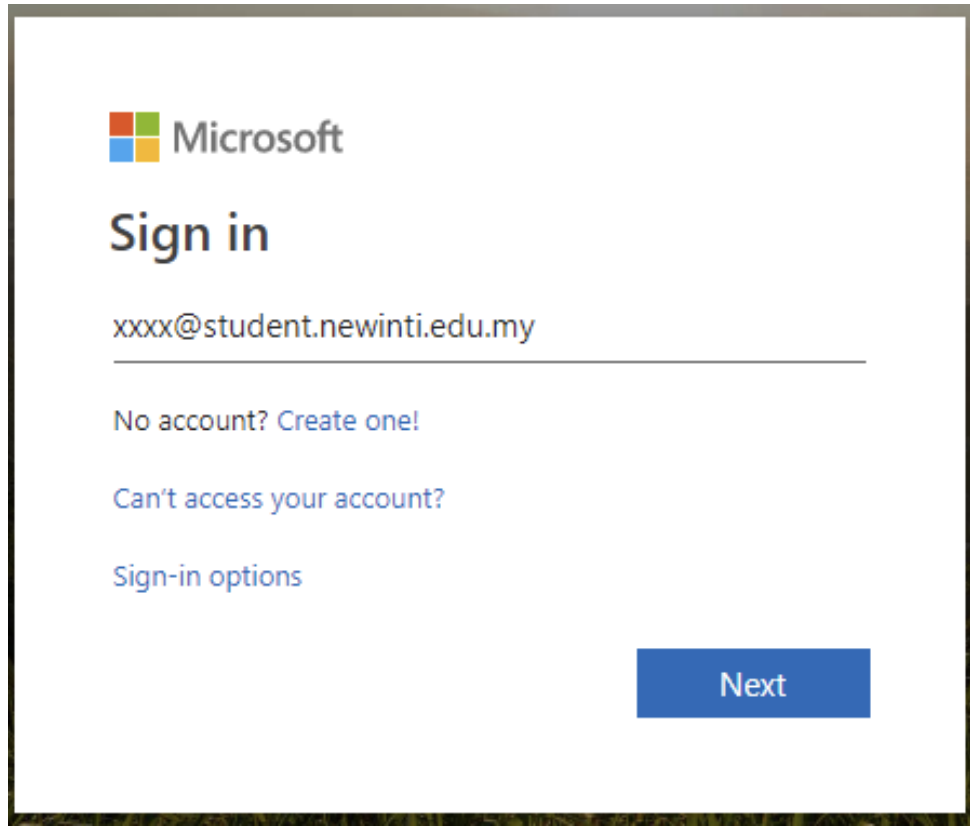

# Table of Contents
- [Step by Step Guide to Sign Up and Download Microsoft Office 365](#step-by-step-guide-to-sign-up-and-download-microsoft-office-365)
- [Frequently Asked Questions (FAQ)](#frequently-asked-questions-faq)
- [Contributors](#contributors)

## Step by Step Guide to Sign Up and Download Microsoft Office 365

### 1. Go to https://bit.ly/32s12g0 and enter your INTI student email address (xxx@student.newinti.edu.my).

### 2. Click “I’m a student”.
   

### 3. Create your account and enter the verification code. Verification code has been sent to your INTI student email. Click “Start” to continue.

### 4. Click “Skip”.
   

### 5. Click “Install Office” and “Office 365 apps”.

### 6. Wait for the installer to be downloaded.

### 7. Run the downloaded installer and follow the instructions.

### End

- To access your Microsoft Office 365 account in the future, go to http://portal.office.com and
sign in with your account. 

- To install your Microsoft Office 365, follow the Step 5 – 7 to download and install Microsoft Office.

Reference link: https://sites.google.com/newinti.edu.my/intihub/get-office-365?authuser=0

    <b><a href="#table-of-contents">^&nbsp Back To Top</a></b>

## Frequently Asked Questions (FAQ)

1. I forgot my INTI Microsoft student account password, what should I do?
**Please send an email to helpdesk@newinti.edu.my to ask for account password reset during working hours.**
 

2. Why I could not join a Team via link?
**Please ensure you are using your INTI Microsoft student account.**

    <b><a href="#table-of-contents">^&nbsp Back To Top</a></b>

## Contacts of Microsoft Modern Workplace Squad Leaders

- Lee Zhen Hao
j19030823@student.newinti.edu.my
- Chung Yee Han
i18015334@student.newinti.edu.my
- Crystal Lim Bee Yean
i16011167@student.newinti.edu.my
- Rafia Ferdous Mim
j17025920@student.newinti.edu.my

    <b><a href="#table-of-contents">^&nbsp Back To Top</a></b>

## Contributors
>Names are listed in alphabetical order
<h6>Microsoft Malaysia Ambassadors </h6>

:star: Chin Wen Man
:star: Chung Yee Han
:star: Evelyn Cheah
:star: Stephanie Chong 

    <b><a href="#table-of-contents">^&nbsp Back To Top</a></b>

