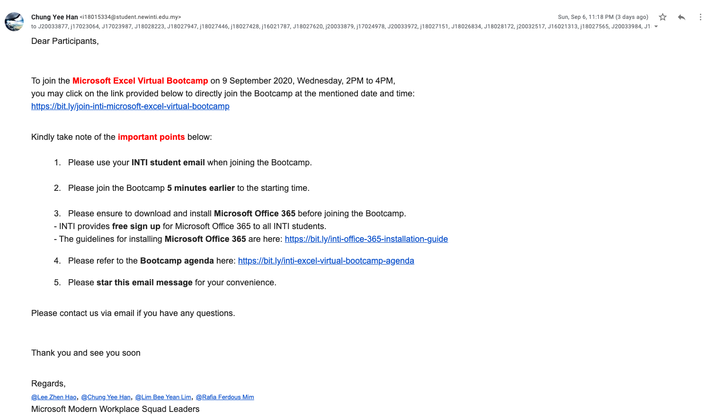

<h2><u>What to prepare when organizing a virtual Microsoft O365 Bootcamp?</u></h2> 

- [Table of contents](#table-of-contents)
  - [1. Create a Bootcamp agenda](#1-create-a-bootcamp-agenda)
  - [2. Create registration form](#2-create-registration-form)
  - [3. Create feedback form](#3-create-feedback-form)
  - [4. Schedule a meeting](#4-schedule-a-meeting)
  - [5. Blast email to all participants registered](#5-blast-email-to-all-participants-registered)
  - [6. During Bootcamp](#6-during-bootcamp)
  - [7. End of Bootcamp](#7-end-of-bootcamp)
  - [8. Post-mortem](#8-post-mortem)
  - [9. Final work](#9-final-work)
  
# Table of contents

## 1. Create a Bootcamp agenda

- May refer to the previous agenda created.

## 2. Create registration form 

- Create a Microsoft registration form.

## 3. Create feedback form 

- Create a Microsoft feedback form.

## 4. Schedule a meeting

- Schedule via Teams calendar feature.
- Modify "Meeting options".

## 5. Blast email to all participants registered

- To add on, students should be guided to install **Microsoft Teams** prior to the Bootcamp to ensure guaranteed access to the Bootcamp.
- If possible, we have to include the hands-on files in the email for students' convenience.
- Format is provided below:

  

## 6. During Bootcamp

- Record the Bootcamp using the recording feature provided by Teams.

## 7. End of Bootcamp

- Collect feedback from the participants. Either send hyperlink or display the QR code generated by Microsoft Forms.
- Generate "Attendance list" in the end of the Bootcamp via the menu.
- End the recording.

## 8. Post-mortem

- Meeting discussing on the feedback collected from the participants to improve the Bootcamp.

## 9. Final work

- Download and upload the recorded Bootcamp to Microsoft Modern Workplace Squad Team's SharePoint.
- Store the attendance list in the mentioned SharePoint as well and send the attendance list generated to respective person if required.

